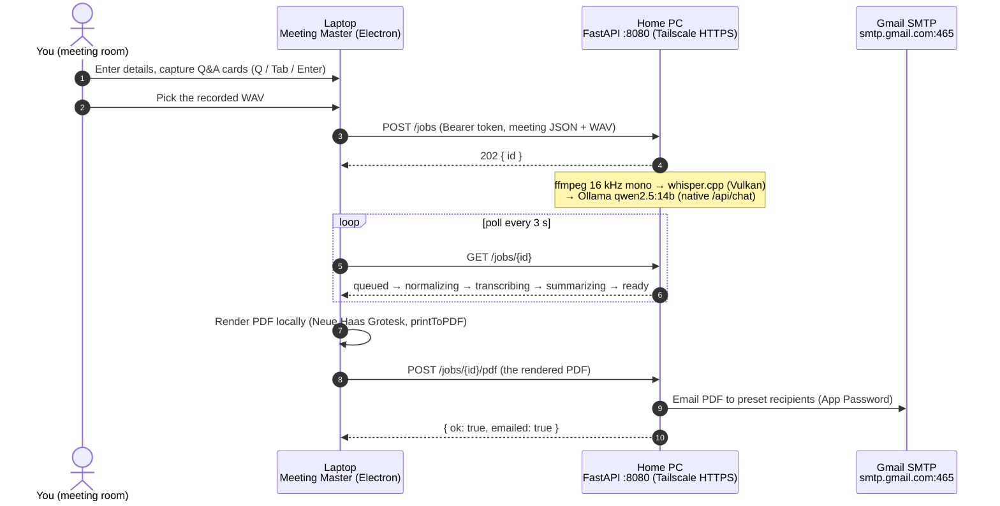

# Meeting Master

Meeting Master is a two-machine, self-hosted meeting-notes pipeline. In the
meeting room, a portable Electron app on the work laptop captures meeting
details and keyboard-driven Q&A cards while Vibe/OBS records the audio. After
the meeting, the app uploads the WAV over Tailscale to an always-on home PC,
where a FastAPI job service normalizes the audio with ffmpeg, transcribes it
with whisper.cpp (Vulkan build on an AMD RX 7900 XTX), and summarizes it with
a local Ollama model (`qwen2.5:14b-instruct-q6_K`). The laptop then renders a
print-perfect PDF locally (Neue Haas Grotesk, 24pt details/questions, 16pt
summary, color-coded) and sends it back to the home PC, which emails it via
Gmail SMTP to a preset recipient list. No cloud AI, no third-party services —
just your two machines and your tailnet.

## How the two machines talk



Why the PDF makes a second round trip (laptop renders, home PC emails) is
explained in [docs/ARCHITECTURE.md](docs/ARCHITECTURE.md).

## Repeatable per-meeting workflow

**Before the meeting**

1. Start the Vibe/OBS audio recording.
2. Open Meeting Master and fill in the meeting details: title, date, time,
   attendees.

**During the meeting**

3. Press **Q** anywhere → the question modal opens.
4. Type the question, **Tab** → type the answer, **Tab** → type/select the
   participant who answered (attendees are suggested), **Enter** → the card is
   saved. (**Shift+Enter** adds a newline inside the answer; **Escape**
   cancels.)
5. Repeat for every notable Q&A. Click any card to edit it in place.

**After the meeting**

6. Stop the recording and note where the WAV was saved.
7. In Meeting Master, click **Pick audio & start AI** and select the WAV. The
   app uploads it to the home server and polls progress
   (queued → normalizing → transcribing → summarizing → ready).
8. When the job is **ready**, click **Generate PDF**. The PDF is saved under
   `Documents\MeetingMaster\` — click **Open PDF** to review it.
9. Click **Send email**. The home server emails the PDF to the preset
   recipient list using the preset template. Done.

## Quickstart

Two setup guides, one per machine — do the home PC first (the laptop needs its
URL and token):

- **Home PC** (Windows, always on, AMD GPU): [docs/SETUP_HOMEPC.md](docs/SETUP_HOMEPC.md)
- **Laptop** (Windows work laptop): [docs/SETUP_LAPTOP.md](docs/SETUP_LAPTOP.md)

Also see [docs/ARCHITECTURE.md](docs/ARCHITECTURE.md),
[docs/FONTS.md](docs/FONTS.md), and
[docs/TROUBLESHOOTING.md](docs/TROUBLESHOOTING.md).

## Repo layout

| Path | What it is |
| --- | --- |
| `app/` | Electron laptop app (`npm start`, portable exe via `npm run dist`) |
| `app/src/main/` | Main process: config, IPC, PDF rendering, home-server client, SMTP |
| `app/src/preload/` | `contextBridge` — the only bridge to `window.api` |
| `app/src/renderer/` | UI (details form, Q&A capture, generate/send) + print template |
| `app/src/shared/schema.js` | Single source of truth for IPC channel names + job states |
| `app/assets/fonts/` | Licensed Neue Haas Grotesk files (git-ignored, see `docs/FONTS.md`) |
| `app/test/e2e/` | Playwright test suite |
| `server/` | FastAPI home AI server (port 8080) |
| `server/app/pipeline/` | normalize (ffmpeg) → transcribe (whisper.cpp) → summarize (Ollama) |
| `server/app/routes/` | `/health` and `/jobs` endpoints |
| `server/app/mailer/` | Gmail SMTP sender |
| `server/tests/` | pytest suite (with fake ffmpeg/whisper stubs) |
| `config/` | `*.example` configuration templates (committed) |
| `docs/` | Setup, architecture, fonts, troubleshooting |
| `scripts/homepc/`, `scripts/laptop/` | Helper scripts for each machine |

## Configuration overview

Only the `*.example` files are committed; every real copy is git-ignored.

| Template (committed) | Real copy (git-ignored) | Used by |
| --- | --- | --- |
| `config/laptop.env.example` | `%APPDATA%\MeetingMaster\laptop.env` (dev: `app/laptop.env` next to `package.json`) | Laptop app — server URL, token, email mode, page size |
| `config/server.env.example` | `server/server.env` | Home server — token, tool paths, models, SMTP |
| `config/recipients.example.json` | `config/recipients.json` | Home server — preset recipient list |
| `config/email_template.example.txt` | `config/email_template.txt` | Home server — email subject/body template |

The `BEARER_TOKEN` in `laptop.env` and `server.env` must be the same string —
it is the shared secret for every `/jobs` request.

## Development

Everything runs on Linux/macOS too for development; Windows is the deployment
target.

**Laptop app** (Electron):

```bash
cd app
npm install
npm start
```

Dev nicety: press **Ctrl+Shift+M** in the running app to load the mock meeting
fixture (`app/test/fixtures/mockMeeting.json`) — details, cards, transcript,
and summary — so you can exercise PDF rendering without a home server.

**Home server** (FastAPI):

```bash
cd server
python -m venv .venv && source .venv/bin/activate
pip install -r requirements.txt
cp ../config/server.env.example server.env   # then edit it
python -m uvicorn app.main:app --host 0.0.0.0 --port 8080
```

**Test suites:**

```bash
cd app && npx playwright test
cd server && python -m pytest tests/ -q
```
