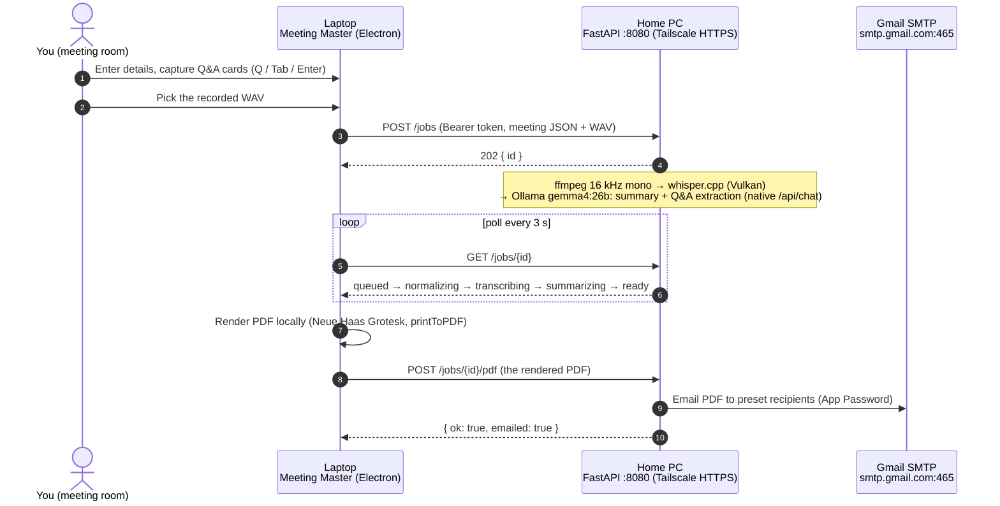

# Meeting Master

Meeting Master is a two-machine, self-hosted meeting-notes pipeline. In the
meeting room, a portable Electron app on the work laptop captures meeting
details, keyboard-driven Q&A cards, and the audio itself — the built-in
**Record audio** panel captures the microphone (crash-proof: audio is flushed
to disk every 5 seconds, and an interrupted session is offered for recovery on
the next launch). An external recorder (Vibe/OBS) still works via **Upload
audio file…** if you prefer. After the meeting, the app uploads the recording
over Tailscale to an always-on home PC,
where a FastAPI job service normalizes the audio with ffmpeg, transcribes it
with whisper.cpp (Vulkan build on an AMD RX 7900 XTX), and with a local Ollama
model (`gemma4:26b`) both writes a structured summary (Key Takeaways /
Decisions / Action Items / Key Figures / Topics) and extracts candidate Q&A pairs for the
operator to approve. The laptop then renders a print-perfect PDF locally (Neue
Haas Grotesk, medical-blue accent, ruled Q&A table + presentation-style summary
deck) and sends it back to the home PC, which emails it via Gmail SMTP to a
preset recipient list. No cloud AI, no third-party services — just your two
machines and your tailnet.

## How the two machines talk



Why the PDF makes a second round trip (laptop renders, home PC emails) is
explained in [docs/ARCHITECTURE.md](docs/ARCHITECTURE.md).

## Repeatable per-meeting workflow

**Before the meeting**

1. Open Meeting Master, pick your microphone in the **Record audio** panel and
   click **Start recording** (or start an external Vibe/OBS recording if you
   prefer). The elapsed timer, level meter, and a red dot on the sidebar show
   it is rolling; everything captured is already safe on disk every 5 seconds.
2. Fill in the meeting details: title, date, time, attendees.

**During the meeting**

3. With **Live transcript (beta)** enabled (Record panel checkbox; model
   downloaded once via Settings → Live transcription), a rolling draft
   transcript appears while people talk — whisper.cpp running on the laptop's
   own GPU. When the home server is reachable over Tailscale, its AI also
   flags **live question candidates** in the Q&A panel: click **Approve** to
   turn one into a card (or **Dismiss** it) without breaking your flow. The
   draft is advisory; the full-quality transcript still comes after the
   meeting, and anything the live pass missed is caught by the post-meeting
   question detection.
4. Two ways to capture, both always available:
   * **Fast** — type straight into the bar at the top of the Q&A panel and press
     **Enter**. The cursor stays put, so a run of questions is one continuous
     action. **More fields…** hands what you've typed to the full card.
   * **Full** — press **Q** anywhere → the question modal opens.
5. In the modal: type the question, **Tab** → type the answer, **Tab** →
   type/select the participant who answered (attendees are suggested),
   **Enter** → the card is saved. (**Ctrl+Enter** saves and keeps the modal open
   for the next question; **Shift+Enter** adds a newline inside the answer;
   **Escape** cancels.)
6. Repeat for every notable Q&A. **A question with no answer yet is a normal
   card, not a broken one** — it shows a faint *"+ Add an answer"* line you can
   click (or press **A** on the focused card) whenever the answer actually
   arrives, three minutes later. Every card also carries the moment it was
   captured (`04:12` into the recording), which is what makes step 9's
   answer-drafting possible. Type an answerer who isn't on the attendee list and
   the app offers to add them, so the name is spelled the same everywhere from
   then on.
7. **Click a question or answer to edit it right
   there** — Enter saves, Escape reverts, and the pencil on the card opens the
   full dialog when you need the answerer too. The list is one tab stop:
   **↑/↓** move between cards, **E** edits the focused one in place, **A** jumps
   straight to its answer, **Delete**
   removes it (undoable), and **Alt+↑/↓** reorders — or drag a card by its grip.
   **Ctrl+K** opens a command palette — every action in the app by name,
   filtered to the ones that are actually available right now. Press **?** for
   the full shortcut list.

**After the meeting**

8. Click **Stop & use recording** — the recording attaches to the meeting.
   (External recording instead? Click **Upload audio file…** and pick the WAV.)
9. Click **Generate transcript**. The app uploads the attached recording to
   the home server and polls progress
   (queued → normalizing → transcribing → transcript ready).
10. When the transcript is ready, the **Fix names** review opens automatically:
   every name found in the transcript is listed with its count, sound-alike
   misspellings come pre-suggested for merging into your attendees, and
   corrections rewrite the stored transcript BEFORE any AI reads it. Click
   **Apply & start AI** (or **Start AI** later). When the AI finishes, a
   **"detected questions"** prompt may appear in the Q&A panel. Click **Review & add** to approve the Q&A pairs it
   found — keep the good ones (low-confidence answerers are flagged), fix the
   answerer, and they become normal cards (nothing is added automatically).
   Left some answers blank during the meeting? Click **Fill blank answers** —
   for each unanswered card the server reads only the conversation *around the
   moment you wrote that question down* (45 seconds before, three and a half
   minutes after) and drafts the answer from it, rather than searching the whole
   recording. The drafts open in a review: confident ones are pre-ticked, unsure
   ones are flagged **check this one** and start unticked, every answer is
   editable before you accept it, and a question the transcript genuinely never
   answered is simply left blank.
   Optionally click **Edit summary** to tweak the Key Takeaways, Decisions,
   Action Items, Key Figures, and Topics before printing. Click **Preview** to
   see the printed document in its own window — the same template, fonts, paper
   size and margins the PDF will use, so it is a proof rather than an
   impression; press Preview again after an edit and the same window refreshes.
   Then click **Generate PDF** — saved under `Documents\MeetingMaster\`; click
   **Open PDF** to review it.
11. Click **Send email**. The home server emails the PDF to the preset
   recipient list using the preset template. Done.

**Accessibility.** Settings carries two controls that stay out of each other's
way: **Text size** scales type only (90/100/112/125%), while **Display zoom**
(`Ctrl` `+`/`−`) scales the whole window — they combine, and text size has no
keyboard shortcut so it can't be nudged mid-meeting. **High contrast** applies
on top of whichever theme is active rather than replacing it: stronger ink,
borders and accents in both light and dark. Every preference is applied before
the first paint, so nothing flashes on launch.

**Fitting the window.** The Meeting screen goes two-column as soon as the panels
have room for it — working column (Q&A, Generate) on the left, context column
(Details, Record) on the right — so a docked laptop stops reading like a phone.
The sidebar collapses to icons (the button beside the logo), the live
suggestions rail can be dragged wider or narrower by the handle beside it (or
resized with the arrow keys once focused), and the Q&A list has a **Compact**
toggle for long meetings. All four preferences are remembered.

Past meetings are saved automatically (and via **History → Save current**);
reopen any of them from the **History** button to review, regenerate, or re-send.
A recurring meeting doesn't need retyping: **Start like this** on any saved
meeting opens a fresh one carrying its title, time, attendees and recipients,
dated today — no cards, no transcript, no recording.
Any server-side job can also be pulled back in from **Activity → Open in
Meeting** — including on the home server itself, where the app window is the
same meeting UI with the server dashboard as a sidebar tab (v0.5.0+). If the local model can't summarize a meeting, **Copy AI prompt**
hands the transcript + instructions to any external AI, and **Edit summary →
Import AI output** brings its JSON reply back for the PDF
(see docs/TROUBLESHOOTING.md).

**Updates are automatic** (v0.2.1+): the home server watches GitHub for new
releases (add a read-only GitHub token on its dashboard while the repo is
private) and serves them to every machine; the app downloads updates in the
background and applies them on restart. Licensed fonts live in an update-proof
folder (operator **Settings → Open fonts folder**).

## Quickstart

**One installer, two modes** (v0.3.0+). Download
`MeetingMaster-Setup-<version>.exe` from the
[latest release](../../releases/latest) (or from the **build-installers**
[Actions](../../actions) run: artifact `app-installer`), run it on **both**
machines, and pick the machine's role on first launch — do the home PC first
(it produces the **Connection Code** the laptop needs).

1. **Home PC** — install, launch, choose **Home server** mode. The bundled AI
   server starts and the app shows the **dashboard** (Overview · Jobs · Logs ·
   Settings, light/dark). On first run, enter your Gmail App Password +
   recipients under **Settings**, click **Install** for Ollama / Tailscale /
   the AI models on **Overview** (wait for green checks), sign in to
   Tailscale, then **Save & Finish** and copy the **Connection Code**. The app
   lives in the tray, starts at login, and keeps serving with the window
   closed.
2. **Laptop** — install the same exe, choose **Operator** mode, install
   Tailscale and sign in to the **same** account, then open **Settings** and
   **paste the Connection Code**. Done.

Migrating from v0.2.x? See
[docs/TROUBLESHOOTING.md](docs/TROUBLESHOOTING.md) — in short: uninstall the
old "Meeting Master Home Server" app, install this one, pick Home server mode;
all settings, models and data carry over automatically.

Full walk-throughs: [docs/SETUP_HOMEPC.md](docs/SETUP_HOMEPC.md) and
[docs/SETUP_LAPTOP.md](docs/SETUP_LAPTOP.md). Also see
[docs/ARCHITECTURE.md](docs/ARCHITECTURE.md),
[docs/FONTS.md](docs/FONTS.md), and
[docs/TROUBLESHOOTING.md](docs/TROUBLESHOOTING.md).

## Repo layout

| Path | What it is |
| --- | --- |
| `app/` | The Electron app — BOTH modes (`npm start`; unified NSIS setup exe via `npm run dist`) |
| `app/src/main/` | Main process: mode selection, sidecar server manager, config, IPC, PDF rendering, home-server client, SMTP |
| `app/src/preload/` | `contextBridge` — the only bridges to `window.api` |
| `app/src/renderer/` | Operator UI (sidebar shell: Meeting · Activity · History · Settings), mode chooser + server boot pages, dark/light themes, print template |
| `app/src/shared/schema.js` | Single source of truth for IPC channel names + job states |
| `app/assets/fonts/` | Licensed Neue Haas Grotesk files (git-ignored, see `docs/FONTS.md`) |
| `app/sidecar/` | CI drops the frozen Python server here; ships as `resources/server` |
| `app/test/e2e/` | Playwright test suite |
| `server/` | FastAPI home AI server (port 8080; `python -m app.main` in a dev checkout) |
| `server/app/pipeline/` | normalize (ffmpeg) → transcribe (whisper.cpp) → summarize + extract Q&A (Ollama) |
| `server/app/routes/` | `/health`, `/jobs`, live monitoring (`/events` SSE, `/logs/tail`), update feed (`/updates/laptop/*`) |
| `server/app/mailer/` | Gmail SMTP sender |
| `server/tests/` | pytest suite (with fake ffmpeg/whisper stubs) |
| `installer/` | Sidecar packaging: PyInstaller spec + bundled `bin/` (ffmpeg, whisper) |
| `.github/workflows/` | `build-installers.yml` — sidecar → unified installer → release |
| `config/` | `*.example` configuration templates (dev/reference only) |
| `docs/` | Setup, architecture, fonts, troubleshooting |
| `scripts/` | Dev helpers (`laptop/dev.ps1`, `homepc/build_whisper_vulkan.md`) — not needed for install |

## Configuration overview

For normal use you configure nothing by hand. The home server's **Setup page**
(`http://127.0.0.1:8080/setup`) writes its settings to
`%APPDATA%\MeetingMaster\server.env`, and the laptop gets the server URL and the
shared bearer token from the **Connection Code** you paste into Settings — the
two `BEARER_TOKEN`s always match because they come from the same code.

The committed `config/*.example` files are **dev/reference only** — they
document the keys the setup page manages:

| Template (reference) | Where the real values live | Used by |
| --- | --- | --- |
| `config/server.env.example` | `%APPDATA%\MeetingMaster\server.env` (written by the setup page) | Home server — token, models, SMTP |
| `config/recipients.example.json` | `%APPDATA%\MeetingMaster\recipients.json` (set on the setup page) | Home server — preset recipient list |
| `config/email_template.example.txt` | `%APPDATA%\MeetingMaster\email_template.txt` (set on the setup page) | Home server — email subject/body template |
| `config/laptop.env.example` | app Settings (from the Connection Code); dev: `app/laptop.env` | Laptop app — server URL, token, email mode, page size |

## Development

Everything runs on Linux/macOS too for development; Windows is the deployment
target.

**The app** (Electron — shows the mode chooser on first dev run; pick
Operator, or set `APP_MODE=operator` in `app/laptop.env`. Server mode in dev
spawns the repo's Python server via `server/.venv`):

```bash
cd app
npm install
npm start
```

Dev nicety: press **Ctrl+Shift+M** in the running app to load the mock meeting
fixture (`app/test/fixtures/mockMeeting.json`) — details, cards, transcript,
and summary — so you can exercise PDF rendering without a home server.

**Home server** (FastAPI):

```bash
cd server
python -m venv .venv && source .venv/bin/activate
pip install -r requirements.txt
python -m app.main   # serves on 0.0.0.0:8080
```

With no `BEARER_TOKEN` configured the server starts in **setup mode** — open
`http://127.0.0.1:8080/setup` to configure it (the same page the installed app
shows on first run). Settings are written to the config home
(`$XDG_CONFIG_HOME/MeetingMaster` on Linux/macOS, `%APPDATA%\MeetingMaster` on
Windows); override it with `MEETING_MASTER_HOME`. In a dev checkout, ffmpeg and
`whisper-cli` are taken from `PATH`; the packaged server bundles them.

**Test suites:**

```bash
cd app && npx playwright test
cd server && python -m pytest tests/ -q
```
