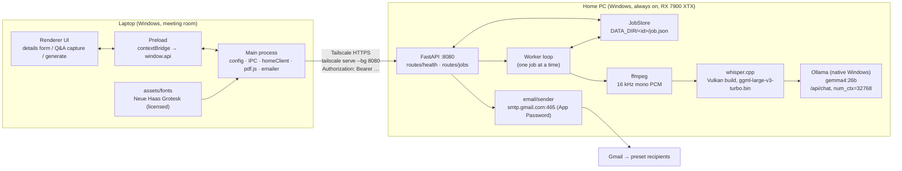
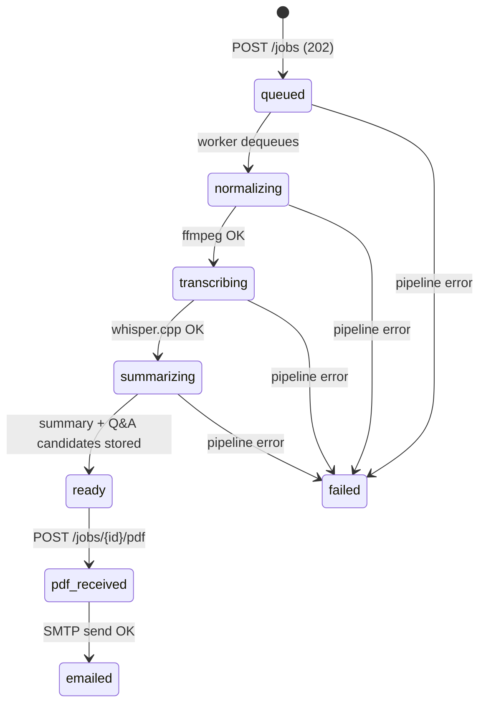

# Architecture

Two machines, one repo. The **laptop** runs an Electron app (UI, keyboard
capture, local PDF rendering). The **home PC** runs a FastAPI job service that
owns everything heavy or credentialed: GPU transcription, LLM summarization,
and the Gmail SMTP send. Tailscale connects them with an authenticated HTTPS
URL; a shared bearer token authenticates every job request on top of that.

## Components



## Packaging & distribution

The project ships as **two unsigned Windows installers**, built by CI
(`.github/workflows/build-installers.yml`) on `windows-latest` runners and
attached to a GitHub Release on each `v*` tag:

- **Laptop** — `MeetingMaster-Setup-<version>.exe`, the Electron app packaged
  with electron-builder (NSIS target). Artifact `laptop-installer`.
- **Home server** — `MeetingMaster-HomeServer-Setup.exe`, the FastAPI server
  frozen with **PyInstaller** (onedir) and wrapped with **Inno Setup**. The
  installer bundles the native tools the pipeline shells out to: `ffmpeg.exe`
  and the **Vulkan** whisper.cpp CLI (`whisper-cli.exe` + its ggml/whisper
  DLLs), staged into `installer/server/bin/` by CI — the whisper.cpp Vulkan
  build is compiled from source in the workflow. The **AI models are not
  bundled** (they are large and change); they're downloaded on first run.
  Artifact `homeserver-installer`.

Both installers are per-user (no admin) and unsigned (SmartScreen "More info →
Run anyway"; optional Authenticode signing is noted in the docs).

**First-run setup page.** Instead of hand-edited env files, the home server
serves a setup page at `http://127.0.0.1:8080/setup`. Until a `BEARER_TOKEN` is
saved the server is in **setup mode** (`Settings.is_configured` is false and
`/jobs` is refused). The page collects email settings + recipients, drives
**guided dependency installs** (Ollama, Tailscale, and the whisper/Ollama
models) behind Install buttons, and, once Tailscale is signed in and the token
is generated, emits a **Connection Code**.

**Connection-code pairing.** The Connection Code bundles the home server's
tailnet URL and the shared bearer token into one string. Pairing the laptop is
"paste the code into Settings" — no manually matched tokens, no typed URLs. The
laptop derives its `HOME_SERVER_URL` + `BEARER_TOKEN` from the code.

**Config home + auto-start.** The server reads/writes its settings, models, and
job data under a writable per-user directory — `%APPDATA%\MeetingMaster` on
Windows (see `server/app/config.py` → `config_home()`), never the read-only
install folder. The installer registers the server to **auto-start at login**
with a **tray icon**; Tailscale and Ollama likewise start at login, so a reboot
brings the whole stack back with no manual steps.

## Job state machine

States are defined once in `app/src/shared/schema.js` (`JOB_STATES`) and must
stay in sync with `server/app/models.py` (`JobState`).



Notes:

- `READY_STATES = [ready, pdf_received, emailed]` — the transcript and summary
  exist and the PDF may be rendered/(re)posted. `POST /jobs/{id}/pdf` is valid
  in any of these three states, so a failed email can be retried by posting the
  PDF again.
- If the email leg fails, the job stays in `pdf_received` (the PDF **was**
  stored) and the response carries the error — see the API reference below.
- On server restart, any job that was **not** in a terminal state
  (`ready`/`pdf_received`/`emailed`/`failed`) is marked `failed` with a
  "re-upload the audio" error, because the in-memory queue and any running
  subprocesses are gone.

## HTTP API reference (home server, port 8080)

Auth: every endpoint except `/health` requires
`Authorization: Bearer <token>`, checked with a constant-time compare against
the `BEARER_TOKEN` saved by the setup page (in the config home's `server.env` —
`%APPDATA%\MeetingMaster\server.env` on Windows). Missing/mismatched token →
`401`; an empty token means the server is still in setup mode and refuses jobs.

### `GET /health`

- Auth: **none** (deliberately — reachability probes need no secret).
- Response: `200`

  ```json
  {"status": "ok"}
  ```

### `POST /jobs`

- Auth: Bearer token.
- Body: `multipart/form-data` with two parts:
  - form field `meeting` — the Meeting JSON as a **string** (validated;
    `400` on bad JSON or wrong shape),
  - file field `file` — the audio (WAV).
- The upload is streamed to disk in ~1 MB chunks — the server never reads the
  whole (~600 MB) file into RAM — and the job is **enqueued** for the
  background worker; nothing is processed inline in the request.
- Response: `202`

  ```json
  {"id": "20260716-143201-a1b2c3"}
  ```

Meeting JSON shape (what the renderer builds and `POST /jobs` validates):

```json
{
  "schemaVersion": 1,
  "details": {
    "title": "str",
    "date": "YYYY-MM-DD",
    "time": "HH:MM",
    "attendees": ["str"]
  },
  "cards": [
    { "id": "str", "question": "str", "answer": "str", "participant": "str" }
  ],
  "recipients": ["str"],
  "options": { "whisperModel": "large-v3-turbo", "emailMode": "home" }
}
```

`recipients` is optional; empty/absent means the server uses its preset list
(`config/recipients.json`).

### `GET /jobs/{id}`

- Auth: Bearer token.
- Response: `200` with the Job record, `404` if the id is unknown.

Job record shape:

```json
{
  "id": "str",
  "state": "queued | normalizing | transcribing | summarizing | ready | pdf_received | emailed | failed",
  "createdAt": "iso8601",
  "updatedAt": "iso8601",
  "meeting": { "…": "MeetingJSON as uploaded" },
  "transcript": {
    "text": "str",
    "segments": [ { "start": 0.0, "end": 9.2, "text": "str" } ]
  },
  "summary": {
    "keyTakeaways": ["str"],
    "keyInsights": ["str"],
    "decisions": ["str"],
    "actionItems": [ { "task": "str", "owner": "str", "due": "str", "priority": "high|normal|low" } ],
    "keyFigures": ["str"],
    "topics": ["str"]
  },
  "questions": [
    { "question": "str", "answer": "str", "answerer": "str", "directedTo": "str", "confidence": "high|low" }
  ],
  "pdf": { "received": false, "emailed": false },
  "error": null
}
```

`transcript` and `summary` are `null` until their pipeline stage completes;
`error` is `null` unless `state` is `failed`. Segment `start`/`end` are
**seconds** (float) — the server converts whisper.cpp's millisecond offsets.

### `POST /jobs/{id}/answers`

- Auth: Bearer token.
- Body:

  ```json
  {
    "questions": [ { "id": "str", "question": "str", "atMs": 125000 } ],
    "attendees": ["str"]
  }
  ```

- Drafts an answer for each question from **only the slice of transcript around
  the moment it was written down** — 45 s before `atMs` through 210 s after —
  rather than the whole recording. `atMs` is the elapsed recording time the
  laptop stamped onto the card at capture (`null` for cards captured outside a
  recording, which fall back to the full transcript). Answering is one bounded-
  concurrency chat call per question, so one bad question can't sink the batch.
- Requires a transcript: unknown id → `404`, no transcript yet → `409`, Ollama
  unreachable → `502`. At most 25 questions per request.
- Response: `200`

  ```json
  {"answers": [ { "id": "str", "answer": "str", "answerer": "str", "confidence": "high|low" } ]}
  ```

  An empty `answer` means the window did not contain one — the laptop leaves
  that card blank rather than inventing something.

### Mid-meeting live suggestions

Three bearer-gated endpoints the laptop drives WHILE a meeting is being
recorded, all stateless (no job, no store, nothing persisted). The post-meeting
pipeline over the full transcript stays the quality backstop, so every failure
here is degradable.

| Endpoint | What it does |
| --- | --- |
| `GET /live/config` | How to drive the loop: `{enabled, intervalSec, windowChars, timeoutSec, clientTimeoutSec, model, insights}`. Fetched once per session. |
| `POST /live/warmup` | Loads the live model into VRAM (`keep_alive`) so the first ask doesn't pay for it. Never raises — `{ok, model, latencyMs, error}` IS the diagnosis. |
| `POST /live/questions` | `{transcriptWindow, attendees, alreadyFlagged, alreadyInsights}` → `{questions: [ExtractedQuestion], insights: ["str"]}`. Ollama unreachable/garbled → `502`; empty window → `422`. |

`insights` are candidate **Key Insights** — lessons to apply going forward,
which become the summary's `keyInsights` when the operator keeps one. They are
not a running summary of the meeting; that is the post-meeting `keyTakeaways`.

Two rules this feature is built around, both learned from it not working:

- **The server owns the configuration.** Everything (on/off, `LIVE_MODEL`,
  interval, window, timeout, keep-alive, token budget) lives in `server.env` and
  is edited on the dashboard's **Settings → Live suggestions**, with a **Test
  live suggestions** button that runs the real path over a fixed sample
  conversation. The laptop has no live-suggestion settings of its own — it asks.
- **`clientTimeoutSec` > `timeoutSec`, always.** The laptop must be the more
  patient of the two. It was not: a hard-coded 45 s client timeout against a
  60 s server budget meant a home PC running a big model failed *every* ask
  from the client side while answering fine — three failures, then a two-minute
  backoff, and the feature was dead for the rest of the meeting. Nothing on
  screen said so either, which is why the rail now carries a status line.

When `LIVE_SUGGESTIONS` is false, `/live/config` answers `enabled: false`
(a normal answer, not an error) and the other two return `503`.

### `POST /jobs/{id}/pdf`

- Auth: Bearer token.
- Body: `multipart/form-data`, file field `file` — the PDF rendered on the
  laptop.
- Only valid when the job state is `ready`/`pdf_received`/`emailed`; otherwise
  `409`. Unknown id → `404`.
- The server stores the PDF, marks the job `pdf_received`, then emails it via
  SMTP and marks it `emailed` on success.
- Response: `200`

  ```json
  {"ok": true, "emailed": true, "error": null}
  ```

  If the PDF was stored but the email failed, the response is still `200`
  (the upload leg succeeded) with:

  ```json
  {"ok": false, "emailed": false, "error": "…smtp error…"}
  ```

  The laptop shows the error; retry by sending again — no re-upload of the
  audio needed.

### Live monitoring (v0.2.0)

Written once in `server/app/routes/monitor.py` and mounted twice: bearer-gated
at the API root for the laptop, and loopback-only under `/setup` for the local
dashboard (which therefore works even before first-run setup).

| Laptop (Bearer) | Dashboard (loopback) | What it returns |
| --- | --- | --- |
| `GET /jobs?limit=50` | `GET /setup/jobs` | `{"jobs": [...]}` — trimmed records: `id, state, progress, createdAt, updatedAt, title, error, pdf`. Never transcript/summary/questions. |
| `GET /events` | `GET /setup/events` | Server-Sent Events: `hello` snapshot (`serverTime, configured, version, jobs[]`), then `job` (trimmed record on every store change) and `log` (`{line}`) events, `: ping` comments every 15 s, `Last-Event-ID` replay from a 256-event ring. |
| `GET /logs/tail?lines=200` | `GET /setup/logs` | `{"lines": [...]}` from an in-memory 500-line log ring (`RingLogHandler`). |

### One app, two modes (v0.3.0)

One installer ships everything. The Electron app reads `APP_MODE` from
`laptop.env` on startup (`src/main/config.js:resolveMode` — a config with a
server URL + token but no mode is inferred as operator, so v0.2.x laptops
auto-update seamlessly) and branches in `src/main/main.js`:

- **No mode yet** → a first-run chooser (`mode.html`); the choice persists and
  the app relaunches into it. Modes can be switched later (operator Settings ↔
  server boot page/tray) — switching just rewrites `APP_MODE` and relaunches.
- **Operator** → the meeting-capture UI exactly as before.
- **Home server** → `src/main/serverManager.js` spawns the bundled PyInstaller
  server (`resources/server/MeetingMasterServer.exe`, dev fallback:
  `server/.venv` python) with `MM_SIDECAR=1`, waits on `/health`, and restarts
  it (bounded backoff) if it crashes. The window shows `serverBoot.html` until
  the sidecar is healthy, then navigates to the loopback dashboard. The app
  lives in the tray (close = hide), registers itself as a login item, and owns
  the whole desktop experience — with `MM_SIDECAR=1` the Python side skips its
  own tray/browser-open/self-update. If the port is already served by a
  matching version (dev server) it is adopted; a version mismatch (the old
  standalone Home Server install) surfaces as a "conflict" screen telling the
  operator to uninstall it.

### Auto-updates (v0.2.1, unified v0.3.0)

The home server is the update hub. `server/app/updates.py` checks GitHub
Releases for `UPDATE_REPO` (private repos need `GITHUB_TOKEN` — a fine-grained
PAT with contents:read, entered on the dashboard's Settings tab) on boot and
every `UPDATE_CHECK_HOURS`, picking the newest non-draft release (pre-releases
included) and caching its assets under `<config home>/updates/<tag>/`:
`latest.yml`, `MeetingMaster-Setup-<ver>.exe` (+ `.blockmap`).

- **Both modes update via electron-updater** (generic provider) against
  `GET /updates/laptop/*` (bearer-gated, strict name whitelist). Operator
  machines point at the home server over Tailscale; the home server machine
  points at its own sidecar's loopback feed (token read from `server.env`) —
  nobody's Electron app ever talks to GitHub. Updates download in the
  background; "Restart to update" (toast in operator mode, tray item in server
  mode), and they also apply on the next quit. Before installing, server mode
  stops the sidecar so the installer never hits in-use files; updating the app
  updates the bundled server with it (one version, always in step).
- The GitHub check/cache runs through the setup task machinery
  (`bootstrap.register_component`), so the dashboard's progress bars drive it.
  The pre-v0.3.0 bat-based server self-update remains only for old standalone
  installs and refuses to run in sidecar mode.
- **Fonts note:** the operator's licensed fonts live in the update-proof user
  folder (`userData/fonts`, see docs/FONTS.md) precisely so updates can be
  automatic without losing them.

`GET /setup/assets/{name}` serves the dashboard's CSS/JS by strict whitelist
(deliberately not a `StaticFiles` mount, which would bypass the loopback
guard). The `EventBroker` (`server/app/events.py`) is wired in `main.py`'s
lifespan: `store.on_change` publishes every job mutation; a logging handler
publishes every log line. On the laptop, `src/main/sseClient.js` consumes the
stream (the renderer has no network access and never sees the token) and
re-emits events over the `server:event` IPC channel; the renderer's 3-second
polling remains the functional fallback — SSE failure is only ever cosmetic.

## IPC channels

Channel names live in `app/src/shared/schema.js` (`CHANNELS`) and are used by
both the main process (`src/main/ipc.js`) and the preload script.

| Channel | Direction | `window.api` method |
| --- | --- | --- |
| `job:upload` | renderer → main | `uploadMeeting(meeting, wavFilePath) -> {jobId}` |
| `job:status` | renderer → main | `getJobStatus(jobId) -> Job record` |
| `job:progress` | **main → renderer** | `onJobProgress(cb)` — `cb({jobId\|null, state, message})`; returns an unsubscribe fn |
| `job:draftAnswers` | renderer → main | `draftAnswers(jobId, questions, attendees) -> {answers}` — drafts answers for blank cards from the transcript around each card's capture stamp |
| `pdf:render` | renderer → main | `renderPdf(meeting, summary) -> {pdfPath, fontUsed, warning\|null}` |
| `pdf:preview` | renderer → main | `previewPdf(meeting, summary) -> {ok, fontUsed, warning\|null}` — shows the same render in a reusable child window instead of printing it |
| `pdf:open` | renderer → main | `openPdf(pdfPath) -> {ok}` |
| `pdf:sendHome` | renderer → main | `sendPdfViaHome(jobId, pdfPath) -> {ok, emailed, error\|null}` |
| `pdf:sendLaptop` | renderer → main | `sendPdfViaLaptop(meeting, pdfPath) -> {ok, error\|null}` |
| `file:pickWav` | renderer → main | `pickWavFile() -> {filePath\|null}` |
| `file:pickSave` | renderer → main | `pickSavePath(defaultName) -> {filePath\|null}` |
| `config:get` | renderer → main | `getConfig() -> {serverUrl, emailMode, pageSize, hasToken, configPath}` |

The preload exposes exactly this surface via `contextBridge` — no
`ipcRenderer`, no Node globals. `getConfig()` reports `hasToken` as a boolean
and **never** exposes the token itself to the renderer. Note the renderer
first calls `pickWavFile()` and then passes the returned path to
`uploadMeeting(meeting, wavFilePath)` — the WAV path never enters the renderer
any other way.

## The two-round-trip PDF/email flow — and why

```text
Round trip 1:  laptop --WAV+meeting--> home PC --transcript+summary--> laptop
Round trip 2:  laptop --rendered PDF--> home PC --SMTP--> recipients
```

1. **The PDF is rendered on the laptop, not the server**, because that is
   where the licensed Neue Haas Grotesk files live and where Electron's
   `printToPDF` produces exactly what the print template shows — WYSIWYG. A
   server-side renderer would need a second copy of the licensed fonts plus a
   duplicate of the whole HTML/CSS print stack, and any drift between the two
   would produce PDFs that don't match what the user reviewed.
2. **The email is sent from the home PC, not the laptop** (default
   `EMAIL_MODE=home`), because the Gmail App Password then never touches the
   work laptop, and corporate networks that block outbound SMTP (port 465)
   can't break the send. `EMAIL_MODE=laptop` exists as a fallback that sends
   directly from the app via `smtp.gmail.com:465` (it needs the `SMTP_*`
   values in `laptop.env`).

So the finished PDF travels laptop → home PC once more (`POST
/jobs/{id}/pdf`), and the server does the send. The cost is one extra upload
of a small file; the benefit is perfect typography **and** reliable email.

## Deliberately not built

Kept out on purpose — each would add moving parts without paying for itself
at this scale (one user, a few meetings a week):

- **No database.** Jobs live in a dict and persist as
  `DATA_DIR/<id>/job.json`. Restart-safe enough: terminal jobs reload,
  in-flight jobs are marked `failed`.
- **No Celery / Redis / task broker.** A single `asyncio` worker loop
  processes jobs one at a time — which is also exactly what a single GPU
  wants (one whisper/Ollama job at a time).
- **No streaming / real-time transcription.** The meeting is recorded
  externally (Vibe/OBS) and processed as a batch afterwards. Simpler, and the
  meeting room laptop does no AI work.
- **No server-side PDF rendering.** See the two-round-trip rationale above.
- **No TLS or certificate handling in the app code.** `tailscale serve`
  terminates HTTPS with automatically provisioned certs; the FastAPI process
  only ever speaks plain HTTP on the tailnet-facing loopback.
- **No user accounts.** One shared bearer token; this is a single-user
  system on a private tailnet.
